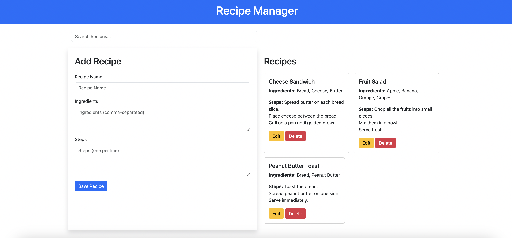

# Recipe-Manager

A simple website to manage recipes. This project allows users to add, edit, delete, and search recipes using a user-friendly interface built with HTML, Bootstrap 5, and JavaScript.

#### Features
> - Add Recipes: Add new recipes with a name, ingredients, and steps.
> - Edit Recipes: Update existing recipes.
> - Delete Recipes: Remove recipes from the list.
> - Search Recipes: Filter recipes by name using a live search bar.
> - Responsive Design: Built with Bootstrap 5.

